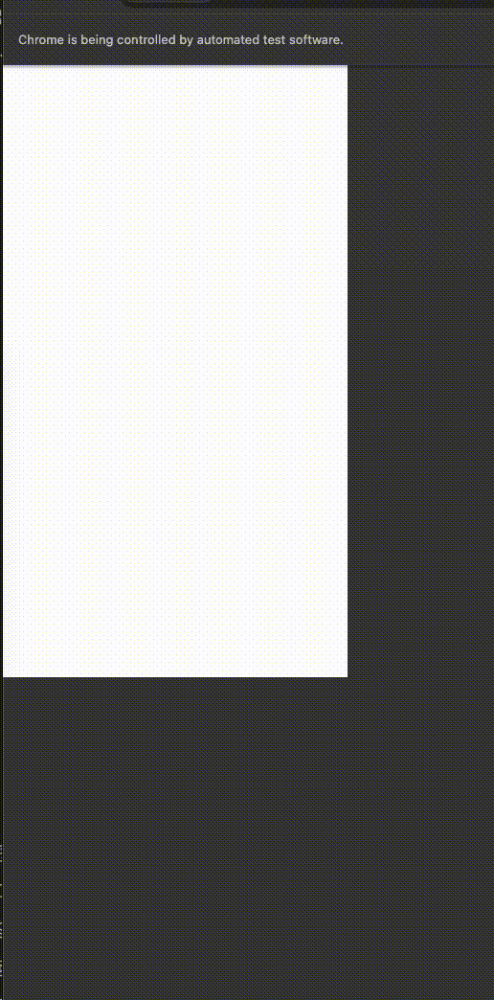

# Python Selenium TEST Example

Example of Selenium test in Python with Pytest. 



## Instalation

Intall required dependecies
```
pip install -r requirements.txt
```

## Test Execution
Run test 
```
pytest -vv selenium_test.py
```